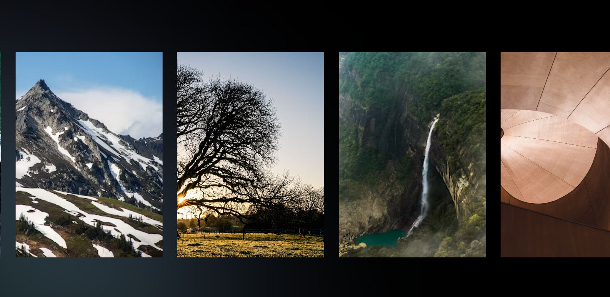

# CSS & JavaScript-Animations:

## Description

This project is aimed to create parallax effects for images and a nice spotlight effect for the mouse. It is aimed to add flair to a slideshow of images that can be used in any application. The challenges faced in this project was finding a way to connect the JavaScript to the CSS through data that can be leveraged from the window. This was the most important part of getting the parallax of the images and the spotlight to follow the mouse.

In the future, I plan to use the skills learnt here to incorporate them into front-end projects to give them an extra pop when users visit the site.

Slideshow Screenshot:

## Installation

Locate a suitable place where you would like to download this repository. Once found, copy the repositories SSH or HTTPS to clone through the terminal or download the zipfile from GitHub. After it is downloaded, right-click the index file and launch with your preferred internet browser.

While in the browser, feel free to examine the HTML and CSS code in developer mode by hitting F12.

## Usage

This repository is allowed for use in a learning environment to evaluate and analyze.

## Credits

Credits are given to the following:

- [Hyperplexed](https://www.youtube.com/watch?v=PkADl0HubMY&t=81s&ab_channel=Hyperplexed) for their youtube tutorial for the parallax effect and mouse follow icon.
